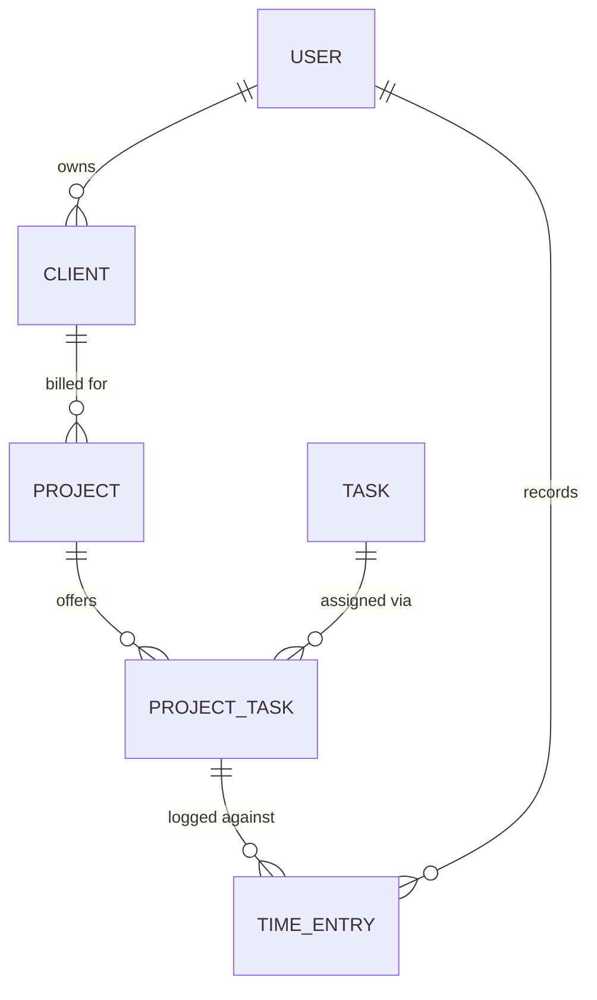

# Conflux — Requirements (Proof of Concept)

Conflux is a self-built alternative to [Harvest](https://www.getharvest.com/): a web app for tracking time against client projects and turning those hours into professional invoices. This document captures the requirements for the **proof-of-concept (POC)** milestone. It is built up interactively and will grow as decisions are made.

## Progress

Interview-driven requirements gathering. Each round produces one section below.

| #   | Section              | Status         |
| --- | -------------------- | -------------- |
| 1   | Framing & scope      | ✅ Done        |
| 2   | Clients & projects   | ✅ Done        |
| 3   | Time tracking        | ✅ Done        |
| 4   | Invoicing            | ✅ Done        |
| 5   | Users & access       | ✅ Done        |
| 6   | Non-functional & tech | ⬜ Not started |

## 1. Framing & scope

### Primary goal

The POC's job is to **demo the vision to stakeholders** to secure buy-in before committing to a full build. Success is measured by "does a clickable walkthrough convince a decision-maker," not by production hardening.

### Users & multi-tenancy

The first working version targets a **single user**, but the data model carries a user/owner concept from the start so that multi-user support is an **additive change, not a rewrite**.

### Eventual scale

The product should eventually serve a **small business of 6–20 people**, which implies real roles (admin vs. member) and per-user reporting down the road. The POC does not implement these, but must not design them out.

### Deployment

Undecided between local-only and hosted. The POC is designed to **run locally now and be hosted later** without major rework — no assumptions that only hold on `localhost`.

### Guiding principles (derived from the above)

- **Polish over robustness.** Because the goal is a stakeholder demo, visible quality (professional-looking invoices, a smooth core click-path) outranks backend edge cases, hardened auth, permissions, and concurrency.
- **Design for multi-user, build for one.** Every table/entity that will eventually be per-user gets an owner reference now, even while only one user exists.
- **No local-only lock-in.** Avoid choices that would make later hosting a rewrite.

## 2. Clients & projects (data-model spine)

This section defines the core entities and how they relate. Everything else (time entries, invoices) wires into these.

### Entities

- **Client** — the company being billed. Fields: name, contact person, email, billing address, currency. Owns projects.
- **Project** — a body of work for one client. Fields: name, `billing type`, `billing method` (when hourly), rate/fee fields (see below), status (active/archived). Belongs to a client. Owns its task assignments.
- **Task** — a reusable, company-wide kind of work (e.g. Design, Development, Meeting, Admin). Maintained as one global list and assigned to projects. Fields: name, default billable flag, active flag.
- **Project ↔ Task assignment** — the join that says "this task is available on this project." Carries the per-project details: billable flag (overrides the task default) and, when the project's billing method is per-task, the task's rate on this project.
- **User** — the owner of the data. Single user for now; every entity above carries an owner reference so multi-user is additive. Will later carry a per-person rate (for the per-person billing method).

### Project billing: two independent selectors

Mirrors Harvest. A project chooses **how it is billed overall** and, when hourly, **where the rate comes from**.

- **Billing type** (all three supported in the POC):
  - `hourly` — bill tracked billable hours × the applicable rate.
  - `fixed fee` — bill a flat agreed amount regardless of hours; time is still tracked for internal cost.
  - `non-billable` — internal/overhead work that is never invoiced (time still tracked for reporting).
- **Billing method** (rate source; only meaningful when `hourly`). All four are modeled; per-project and per-task are fully wired for the demo, per-person and flat are additive later:
  - `per-project` — one rate on the project. Simplest; single source of truth.
  - `per-task` — rate lives on each Project↔Task assignment (Design $150, Admin $75).
  - `per-person` — rate follows the user who logged the time. Needs multi-user to be meaningful.
  - `flat` — one app-wide rate.

### Relationships (at a glance)

### Rate storage: derive, don't duplicate (until finalized)

The rate that applies to a given hour is **derived** from the project's billing method at read time — it is not copied onto every time entry. The one deliberate exception is invoicing: when an invoice is **finalized**, the rates and amounts are **snapshotted onto the invoice**, because a sent invoice is an immutable financial record that must not change if a project's rate is edited later. That stored copy is justified by a real need (historical accuracy), not convenience. Detail lives in the Invoicing section.

## 3. Time tracking

The daily-use feature. Design goal: minimal friction to log an hour, because that is what makes or breaks adoption.

### The time entry, and what a "running timer" really is

A **time entry** captures: date, the project↔task assignment it belongs to, a duration, a free-text note, and its owner. A running timer is not a separate concept — it is a time entry in an **open** state:

- **Running (open):** the entry keeps a start timestamp so the UI can show elapsed time counting up live. This timestamp is timer plumbing, not a user-facing audit record.
- **Stopped (closed):** on stop, elapsed time collapses into a plain stored **duration**; the start timestamp is no longer needed. Manual entries are created closed, with the duration typed directly.

This means "live tracking" and "manual entry" are the same entity in two states, not two systems.

### Ways to log time (both supported)

- **Live timer** — start/stop for real-time work; the headline demo feature.
- **Manual entry** — type project, task, hours, and a note after the fact, for forgotten or estimated time.

### Timesheet views (both supported)

- **Day view** — one day's entries as an editable list, navigate day to day. The default, fast to read.
- **Weekly grid** — a projects×days grid for the week, good for reviewing and bulk entry.

### Single running timer — a policy, not a schema constraint

The POC enforces **at most one running timer** per user (starting a new one stops the current one), matching Harvest and preventing accidental double-billing. This rule is enforced in the **application/business layer**, deliberately **not** as a database uniqueness constraint — so switching to multiple concurrent timers later is a policy change, not a data migration. ("Design for multi-user, build for one" applied to timer concurrency.)

### Assumptions (sensible defaults, revisit if wrong)

- Time entries are **editable and deletable** after creation.
- Duration is stored at fine precision and **displayed as decimal hours** (e.g. `1.5h`); `h:mm` display can be added later.
- **No automatic rounding rules** in the POC (Harvest has configurable rounding; deferred).

## 4. Invoicing

The payoff feature and the heart of the stakeholder demo: turning tracked work into a professional-looking invoice. "Looks professional" is the explicit bar.

### What feeds an invoice (all three, mixable on one invoice)

- **Tracked billable time** — unbilled billable hours for a project become line items (hours × rate).
- **Fixed-fee amount** — a project's flat fee as a single line, independent of hours.
- **Manual line items** — free-form lines the user adds (reimbursables, ad-hoc charges, etc.).

### Line grouping — chosen per invoice

When creating an invoice from tracked time, the user picks how to itemize. All four are computed from the same underlying billable entries — grouping is a presentation choice, not stored duplication:

- **By task** — one line per task (`Design — 12h × $150`). The clean default.
- **By person** — one line per team member (meaningful once multi-user exists).
- **Summary** — a single lump-sum "Services rendered" line.
- **Detailed** — one line per time entry, notes included.

### Lifecycle: draft → finalized → sent → paid

- **Draft** — reads **live** from currently unbilled billable time; edit freely, choose grouping, add manual lines.
- **Finalize** — the numbers **snapshot** onto the invoice (line items, rates, amounts), an **invoice number** is assigned, and the billed time entries are **linked to this invoice** so they can never be invoiced twice. The finalized invoice is immutable: later edits to a project's rate do not change it. (This is the "derive until finalized, then snapshot" rule from §2, realized.)
- **Sent / Paid** — manual status flags (`draft` → `sent` → `paid`). No payment processing or gateway in the POC; "mark as paid" is a human action.

The "billed" state of a time entry is real state (a link to the invoice that billed it), justified because it prevents double-billing — this is a deliberate stored value, not a convenience copy.

### Output

A **polished on-screen invoice** in the browser, plus **PDF download / print**. No email delivery or payment gateway in the POC.

### Invoice fields

- **Header / branding** — company logo, business name, and "from" details.
- **Bill-to** — client name, contact, address, pulled from the Client record.
- **Reference block** — auto invoice number, issue date, due date, payment terms, and the **client PO number**.
- **Line items** — per the chosen grouping.
- **Money block** — subtotal, optional **discount** (percent or flat), optional **tax** (percent applied to subtotal after discount), total.
- **Footer** — notes / terms.
- **Currency** — taken from the client record.

### Money-handling assumption (a "why" worth stating)

Monetary amounts are stored as **integer minor units** (e.g. cents), not floating-point, to avoid rounding errors like `0.1 + 0.2 ≠ 0.3`. Formatting to `$1,800.00` happens only at display time. (In LabVIEW terms: keep the wire an integer of pennies; convert to a formatted string only at the indicator.)

## 5. Users & access

Almost none of this is *built* in the single-user POC, but the *shape* is decided now so multi-user, multi-tenant, and customizable roles are all additive rather than retrofits.

### Authentication (POC vs. target)

- **POC:** a real-looking login screen backed by **one seeded account** (no self-signup). Enough to exercise the "current user" plumbing and look like a product in the demo.
- **Target:** full account management — self-signup, password reset, sessions. The POC's auth is built behind a boundary so this is a swap-in, not a teardown.

### Tenancy: multi-tenant SaaS

Conflux is intended to serve **many isolated companies** from one deployment. Therefore:

- An **Organization** (tenant) is the **top-level owner of all data** and exists from the POC's first table. The single POC user belongs to one Organization.
- **Every entity is keyed by `organization_id`** (Client, Project, Task, Time Entry, Invoice, User, Role, …). Tenant isolation is enforced as a standing query rule, so going from one org to many is additive, not a re-key.
- A SaaS is inherently hosted, so the earlier "hosting undecided" resolves toward **hosted** for the real product; the POC may still run locally.

### Authorization: capability-based RBAC (Discord-style, eventual)

The end goal is **fully customizable roles**: admins can add/modify/delete roles and choose each role's permissions, like Discord. The architecture is built for this from the start:

- **Permissions are granular capabilities** (e.g. `time.track`, `time.view.all`, `client.manage`, `project.manage`, `invoice.manage`, `company.settings`, `users.manage`, `roles.manage`, `billing.account`).
- **Roles are data, not code** — a role is a named set of capabilities stored per Organization, not a hardcoded enum.
- **The golden rule:** business logic checks **capabilities, never role names** (`can(user, "invoice.manage")`, never `if user.role == "manager"`). This is what makes a future role editor a pure addition with no changes to enforcement code.

### POC seed roles

The POC ships three fixed seed roles (rows in the roles table, backed by the capability system above — no role-editor UI yet):

| Role        | Holds capabilities                                                                                     | In plain terms                                              |
| ----------- | ------------------------------------------------------------------------------------------------------ | ---------------------------------------------------------- |
| **Member**  | `time.track`                                                                                           | Logs and views their **own** time.                         |
| **Manager** | Member + `time.view.all`, `client.manage`, `project.manage`, `invoice.manage`                          | Operational: runs clients/projects/tasks and invoicing.    |
| **Admin**   | Manager + `company.settings`, `users.manage`, `roles.manage`, `billing.account`                        | Company/tenant administration.                             |

Notes on intent:

- Admin's distinguishing powers (from the interview) are **company profile & branding**, **tax & currency defaults**, **user management**, and **subscription & billing** (the org's own Conflux SaaS account, distinct from client invoicing) — plus **role management** (`roles.manage`) for the eventual editor.
- The Member↔Manager line is the main operational split: Members track their own time; Managers additionally invoice and manage work.
- Whether "Admin" is an orthogonal flag or a top role is left open — because roles become fully customizable, the seed layout is just a starting configuration, not a fixed hierarchy.

<!-- Section 6 added as the interview progresses. -->
