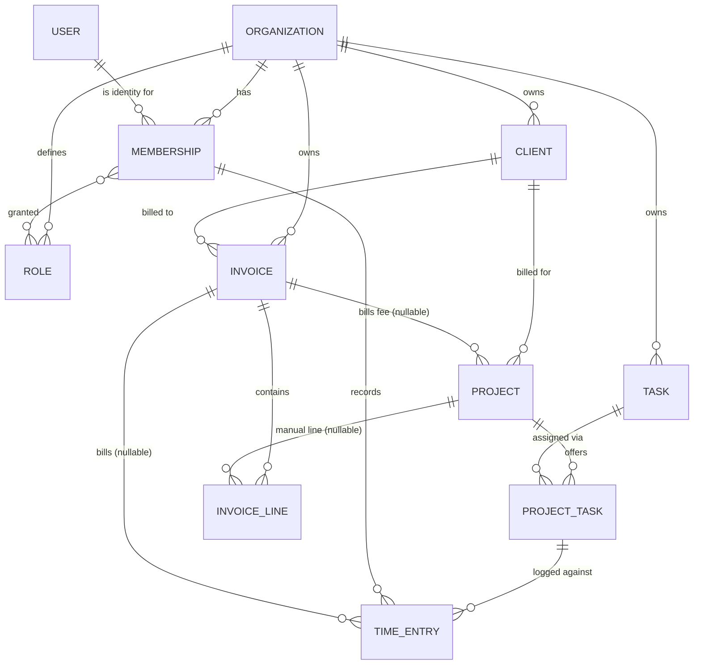

# Data model — Clients, Projects & Tasks

_Part of the [Conflux requirements](../requirements.md). This is the shared spine the feature docs build on; they link here rather than restate it._

This document defines the core entities and how they relate — including how time entries and invoices wire into the client/project/task spine.

## Entities

- **Organization** — the tenant and top-level owner of all data (see [access-control](./access-control.md)). Fields: business name, logo, a free-text "from" block (address + contact email/phone) for invoice headers, plus org-wide defaults that pre-fill new records — default currency, default tax rate, default payment terms, invoice footer/notes, and the invoice-number prefix + next sequence value. Its own Conflux subscription/billing is a later addition (the `billing.account` capability seam), not fields now.
- **User (identity)** — a login: email, password hash, display name. Global and **not** org-scoped; authentication sits behind Auth.js (guardrail G3). A User is _who you are_, independent of any company.
- **Membership** — a User's seat in one Organization: the org-scoped record that carries the person's roles, an `active` flag (deactivate the seat to revoke access without deleting history — G12), and (later) their per-person billing rate. _This_ is what owns time entries and is recorded as `created_by`. Splitting identity (User) from membership lets one person join multiple orgs later without a rewrite.
- **Role** — a named set of capabilities, stored per Organization. A Membership holds **one or more** Roles and its effective capabilities are the **union** (Discord-style). Roles are data, not code — see [access-control](./access-control.md).
- **Client** — the company being billed. Fields: name, contact person, email, billing address (free-text block), currency, status (active/archived). Org-owned. Owns projects.
- **Project** — a body of work for one client. Fields: name, `billing type`, `billing method` (only when hourly), `hourly rate` (used when hourly + per-project), `fixed fee` amount + nullable `fixed_fee_invoice_id` (the fee's anti-double-bill link, set at finalize), status (active/archived). Currency is inherited from the client, not stored again. Belongs to a client; owns its task assignments.
- **Task** — a reusable, company-wide kind of work (e.g. Design, Development, Meeting, Admin). Maintained as one global list per Organization and assigned to projects. Fields: name, default billable flag, active flag.
- **Project ↔ Task assignment** — the join that says "this task is available on this project." Carries the per-project details: an `active` flag (retire the task from this project's picker without touching historic entries), the billable flag (overrides the task default), and — when the project's billing method is per-task — the task's rate on this project.
- **Time entry** — a logged span of work, attributed to the **Membership** that recorded it. Fields: date (date-only), the Project↔Task assignment, duration (integer seconds), note, and a nullable `invoice_id` (set when billed — the anti-double-bill link). Full behavior in [time tracking](./time-tracking.md).
- **Invoice** — a bill to one **Client** (org-scoped). Fields: status (`draft` → `sent` → `paid`), invoice number (assigned at finalize), issue date, due date (defaults to issue + terms, **user-overridable**), payment terms, PO number, discount, tax, footer, and — snapshotted at finalize — the **currency**, money totals, and frozen **bill-to** (client name/contact/address) and **from/branding** (org name/address/contact; logo by reference) blocks. Has many `InvoiceLine`s. Full lifecycle in [invoicing](./invoicing.md).
- **Invoice line** — one line on an invoice. Fields: `source` (tracked-time / fixed-fee / manual), a snapshot **description**, quantity (hours or 1), unit rate, amount, and an optional `project_id` (set on **manual** lines so ad-hoc charges attribute to a project for later reporting — captured at entry, since finalized invoices can't be backfilled). Time and fixed-fee lines are written as an immutable snapshot at finalize; manual lines exist from the draft.

## Ownership & scoping (what "owner" means)

The word "owner" was doing two jobs; keep three ideas separate:

- **Tenant isolation** — every row carries `organization_id` and every query filters by it (guardrail G1). This is what "the Organization owns all data" means.
- **Audit** — Clients, Projects, and Tasks also record a `created_by` Membership, purely for "who added this." They are **org-shared**: visible org-wide and editable by capability (`client.manage`, `project.manage`), never private to their creator.
- **Attribution** — only **Time Entries** are tied to a specific Membership as their subject, which is what makes "show me _my_ hours" and the `time.view.all` capability meaningful.

## Deletion & archival (data integrity)

Billing history is never destroyed by a delete (guardrail **G12**):

- **Archive, don't delete.** A Client, Project, or Task that has any time entries or invoice references **cannot be hard-deleted** — it's retired via its `status`/`active` flag instead. Foreign keys use `Restrict`, not `Cascade`, so a stray delete can't take financial history with it.
- **Retire a task from a project** by clearing the `ProjectTask.active` flag: it drops out of the picker for new entries while existing entries keep working.
- **Cascade only where nothing financial is lost** — deleting a **draft** invoice (which clears any associations and returns entries to the unbilled pool) and removing a **zero-hour** project-task join.

## Project billing: two independent selectors

Mirrors Harvest. A project chooses **how it is billed overall** and, when hourly, **where the rate comes from**.

- **Billing type** (all three supported in the POC):
  - `hourly` — bill tracked billable hours × the applicable rate.
  - `fixed fee` — bill a flat agreed amount regardless of hours; time is still tracked for internal cost.
  - `non-billable` — internal/overhead work that is never invoiced (time still tracked for reporting).
- **Billing method** (rate source; only meaningful when `hourly`). All four are modeled; per-project and per-task are fully wired for the demo, per-person and flat are additive later:
  - `per-project` — one rate on the project. Simplest; single source of truth.
  - `per-task` — rate lives on each Project↔Task assignment (Design $150, Admin $75).
  - `per-person` — rate follows the user who logged the time. Needs multi-user to be meaningful.
  - `flat` — one app-wide rate.

## Relationships (at a glance)

## Rate storage: derive, don't duplicate (until finalized)

The rate that applies to a given hour is **derived** from the project's billing method at read time — it is not copied onto every time entry. The one deliberate exception is invoicing: when an invoice is **finalized**, the rates and amounts are **snapshotted onto the invoice**, because a sent invoice is an immutable financial record that must not change if a project's rate is edited later. That stored copy is justified by a real need (historical accuracy), not convenience. Detail lives in [Invoicing](./invoicing.md).

The same rule governs **currency**: it is **derived from the client**, never copied as a per-row currency column (the duplication trigger A warns about), and one central formatter turns integer minor units into `$1,800.00` only at display. Currency joins the rates and amounts in the finalize **snapshot**, so a finalized invoice keeps its original currency even if the client's is later changed. The POC stores 2-decimal minor units but assumes nothing that blocks other exponents (e.g. JPY, BHD) later — guardrail G4.
