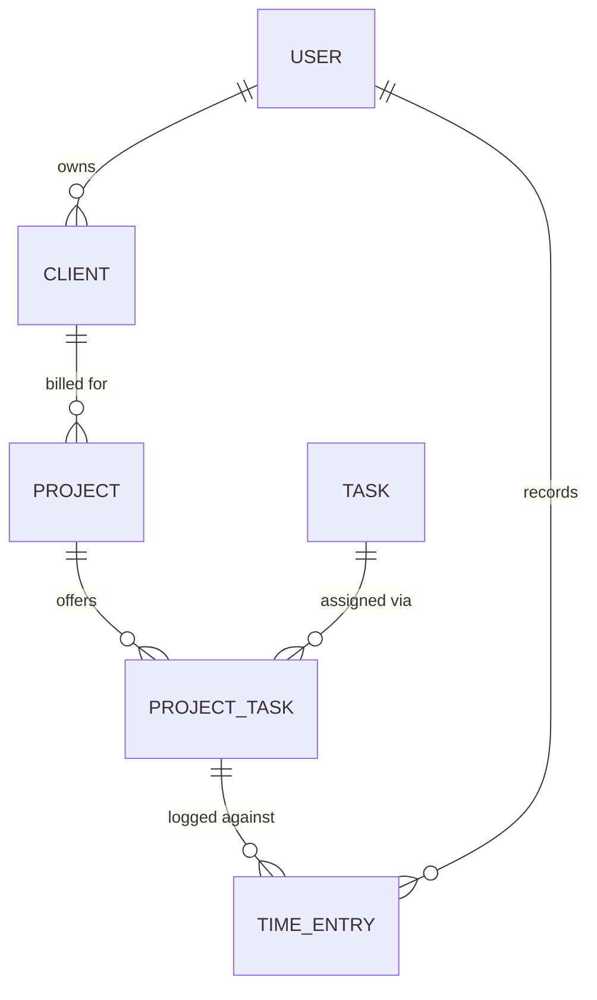

# Data model — Clients, Projects & Tasks

_Part of the [Conflux requirements](../requirements.md). This is the shared spine the feature docs build on; they link here rather than restate it._

This document defines the core entities and how they relate. Everything else (time entries, invoices) wires into these.

## Entities

- **Client** — the company being billed. Fields: name, contact person, email, billing address, currency. Owns projects.
- **Project** — a body of work for one client. Fields: name, `billing type`, `billing method` (when hourly), rate/fee fields (see below), status (active/archived). Belongs to a client. Owns its task assignments.
- **Task** — a reusable, company-wide kind of work (e.g. Design, Development, Meeting, Admin). Maintained as one global list and assigned to projects. Fields: name, default billable flag, active flag.
- **Project ↔ Task assignment** — the join that says "this task is available on this project." Carries the per-project details: billable flag (overrides the task default) and, when the project's billing method is per-task, the task's rate on this project.
- **User** — the owner of the data. Single user for now; every entity above carries an owner reference so multi-user is additive. Will later carry a per-person rate (for the per-person billing method).

## Project billing: two independent selectors

Mirrors Harvest. A project chooses **how it is billed overall** and, when hourly, **where the rate comes from**.

- **Billing type** (all three supported in the POC):
  - `hourly` — bill tracked billable hours × the applicable rate.
  - `fixed fee` — bill a flat agreed amount regardless of hours; time is still tracked for internal cost.
  - `non-billable` — internal/overhead work that is never invoiced (time still tracked for reporting).
- **Billing method** (rate source; only meaningful when `hourly`). All four are modeled; per-project and per-task are fully wired for the demo, per-person and flat are additive later:
  - `per-project` — one rate on the project. Simplest; single source of truth.
  - `per-task` — rate lives on each Project↔Task assignment (Design $150, Admin $75).
  - `per-person` — rate follows the user who logged the time. Needs multi-user to be meaningful.
  - `flat` — one app-wide rate.

## Relationships (at a glance)

## Rate storage: derive, don't duplicate (until finalized)

The rate that applies to a given hour is **derived** from the project's billing method at read time — it is not copied onto every time entry. The one deliberate exception is invoicing: when an invoice is **finalized**, the rates and amounts are **snapshotted onto the invoice**, because a sent invoice is an immutable financial record that must not change if a project's rate is edited later. That stored copy is justified by a real need (historical accuracy), not convenience. Detail lives in [Invoicing](./invoicing.md).
